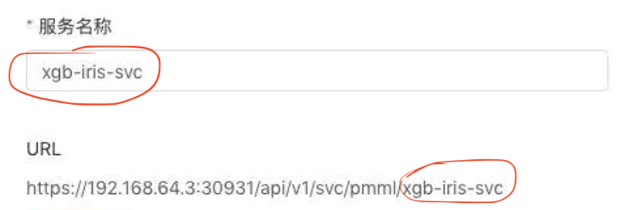

# DaaS-Deployer
2022小学期前后端大作业
## 选题
机器学习模型在线服务
## 分工表
- 前端：董文冲、潘首安、邢海潼
- 后端：罗华坤、李晨宇、何吉轩

## 待讨论的问题
（DAAS界面）
前后端衔接
一堆细节。。。

### 前端
框架：arco.design vue

### 后端
docker+k8s（也许可以参考一下B站上的教程）
Flask
1. 服务器（科协也许）
2. DaaS
3. 测试模型
4. 模型数据

可以先把上传模型的部分写了`db.model`（本地上传到云端+存储云端的地址，丢给前端）（周五之前）

## 功能/进度安排
- [ ]上传模型（pmml + onnx）（后端需要自己写model，用Flask）
    - [ ] 查看模型信息
- [ ]测试模型通过表单输入数据(表单项可能是文本也可能是文件，类似 postman)或者使用 JSON 命令直接输入 JSON 格式的数据，提交后预测结果会显示在界面中
- [ ]部署模型（纯后端，暴露一个给前端，测试时暴露给外部）
    - [ ]对外提供 restful api 接口进行调用
    - [ ]暂停，启动，删除
    - [ ]当前服务的状态
- [ ]前端测试部署的接口
- [ ]对外提供快速返回与等待返回两种API

## 文件/接口说明
- `test.py`中为Flask框架，“测试模型”功能需要从前端读取json格式的输入，见`./data/pmml_input_template.json`，之后返回给前端json格式的输出，见`./data/pmml_output_template.json`
- `manager.py`保存当前加载的模型信息（路径）
- `models.py`中实现模型的信息获取、预测等具体功能
- 使用`./data/pmml_generator.py`可以更换算法生成`.pmml`文件

*by助教：我们需要实现对分类、回归、聚类、降维任务的支持*
### 后端数据生成格式
- 分类: 返回概率分布、label
- 回归: 返回预测值（+置信度）
- 聚类: 等下
- 降维: 也等下


## Restful API文档

### 上传模型

- Post: `/model-upload`

- Param:

  ```json
  reqest{
  	"file": ,
  	"form": {	// 使用表单，会自动存进去
  		"name": ,
  		"type": ,
      "descript": ,
  	}
  }
  ```

- Response:

  ```json
  response{
      "data": {
      	"modelName": ,
      	"modelType": ,
      	"descript": ,
      	"updataTime": ,	// 上传上去的时间
      	"operation": ,
      	"status": ,		// 模型是否有效，无效搞一个报错
  	}
  }
  ```

#### 获得当前所有模型信息

- GET: `/model-info`

- Response:

  ```json
  {
      "data": {
          "模型列表modelList": [] , // 通过model.name, model.type, model.createTime 获得信息
      }
  }
  ```

#### 对模型的操作

- POST: `/operate-model`

- Param:

  ```json
  {
      "模型名称modelName": "",
      "操作类型operation": "",	// "delete"
  }
  ```

- Response:

  ```json
  {
      "data": {
          "操作是否成功status": ,	// True/False
      }
  }
  ```

### 获得模型概述

- POST: `/model-descript`

- Param:

  ```json
  let param = {
      "modelName": 
  }
  axios.GET('url', param)
  ```

- Response:

  ```json
  {
      "data": {
      	"modelName": ,
      	"modelType": ,
      	"modelEngine": ,
      	"descript": ,
      	"algorithm": ,
  	}
  }
  ```

### 获得模型变量

- POST: `/model-variable`

- Param: modelName

- Response:

  ```json
  {
      "data": {
      	"inputVariables":[
      
      	],
  		"targetVariables":[
              
          ]
  	}
  }
  ```

### 测试模型

- POST:`/model-test`

- Param: 按照模板文件`./data/pmml_input_template.json`

  ```json
  {
      "modelName": "",
      "data": {
          // 见./data/pmml_input_template.json
      }
  }
  ```

- Response: 前面的模板文件`./data/pmml_output_template.json`

### 部署实时预测Web服务

- GET:`/model-deploy-service`

- Response:（模型版本问一下）

  ```json
  {
      "data": {
      	"restfulUrl": , // 后端会返回https://host:endpoint/api/v1/scv/pmml/，最后需要前端实时拼接一下服务名称
  	}
  }
  ```



画圈圈的部分需要前端v-bind一下。

python的版本就直接写死3.6, 3.7, 3.8, 3.9吧

提交时

- POST:`/model-deploy-service`

- Param:

  ```json
  {
      "当前的模型名称modelName": ,
      "生成的服务名称serviceName": ,
      "serverVersion": ,
      "cpuReserve": , // 没有选的话给一个null
      "memoryReserve": ,  // 同上
      "replicas": ,
  }
  ```

- Response:

  ```json
  {
      "data": {
          "操作是否成功status": ,	// True/False
      }
  }
  ```

#### "部署"下打开某个service

- POST`service-info`

- Param:

  ```json
  {
      "serviceName": ,
  }
  ```

- Response:

  ```json
  {
      "data": {
      	"restfulUrl": ,
          "当前的模型名称modelName": ,
          "serviceVersion": ,
          "createTime": ,
          "cpuReserve": ,	// 没有返回None
          "memoryReserve": ,	// 没有返回None
          "副本信息列表pod_list": ,	// 通过pod.name, pod.status拿到每个副本的名称和状态
  	}
  }
  ```

#### 指标暂时先空一下

#### 对副本的操作

- POST: `/operate-pod`

- Param:

  ```json
  {
      "副本名称podName": ,
      "操作类型operationType": ,
  }
  ```

- Response

  ```json
  {
      "data": {
      	"操作是否成功status": ,
  	}
  }
  ```

  

### 部署job

目前的想法：在部署页面下点击“添加job”，跳转到添加数据集

#### 切换到“数据集”页面

- GET: `/dataset-info`

- Response:

  ```json
  {
      "data": {
          "数据集信息列表datasetList": [],  // 通过dataset.name, dataset.type, dataset.size, dataset.source, dataset.create_time 拿到信息
      }
  }
  ```

#### 操作数据集

- POST: `/operate-dataset`

- Param:

  ```json
  {
      "操作对象dataset": ,
      "操作类型operation": ,	//"delete", "download"
  }
  ```

- Response:

  ```json
  {
      "data": {
      	"操作是否成功status": // True/False
  	}
  }
  ```

问题：下载怎么搞？把文件传到前端吗？

#### 添加数据集

- POST：`/add-dataset`

- Param:

  ```json
  {
      file: ...,
      form{
          dataSource: "local"/"remote",
      	fileName: ""
  	}
  }
  ```

- Response: 

  ```json
  {
      "data": {
          "操作是否成功status": // True/False
      }
  }
  ```

#### 切换到“批量预测”界面

- GET: `/dataset-info`

- Response:

  ``` json
  {
      "data": {
          "数据集信息列表datasetList": [],  // 通过dataset.name, dataset.type, dataset.size, dataset.source, dataset.create_time 拿到信息
      }
  }
  ```

#### 生成批预测脚本

- POST: `/generate-script`

- Param:

  ```json
  {
      "输入数据集名称inputDataset": ,
      "输出数据集名称outputDataset": ,
  }
  ```

- Response:

  ```json
  {
      "data": {
          "生成的代码code": "...",
      }
  }
  ```

#### 创建任务

点击“高级设置”后的信息保存在前端（所以可能需要默认值），点击“立即执行”后传到后端

- POST: `/model-deploy-job`

- Param:

  ```json
  {
      "文件名fileName": ,
      "扩展名ext": ,
      "任务名称jobName": ,
      "任务描述jobDescription": ,
      "任务运行环境environment": ,	
      "环境变量variables": ,	// 可以先空着
      "命令参数args": ,	// 可以先空着
      "调度dispatch": ,	// "demand", "schedule"
      "运行名称runName": 
  }
  ```

- Response: 

  ```json
  {
      "data": {
          "操作是否成功status": // True/False
      }
  }
  ```

#### 在“部署”中点击打开某个任务

- POST`/job-info`

- Param:

  ```json
  {
      "jobName": ,
  }
  ```

- Response

  ```json
  {
      "data": {
          "任务名称jobName": ,
          "url": ,
          "创建时间createTime": ,
          "任务运行环境environment": ,
          "调度dispatch": ,
          "运行的列表runList": , //通过run.id, run.name, run.createTime, run.duration, run.status获得信息
      }
  }
  ```

`run.status: {"success", "failed", "paused", "running"}`

#### 修改run的状态

- POST: `/operate-run`

- Param:

  ```json
  {
      "副本名称runName": ,
      "操作类型operationType": ,	// "stop", "pause", "continue"
  }
  ```

- Response

  ```json
  {
      "data": {
      	"操作是否成功status": ,	// True/False
          "目前run的状态runStatus": // 见上
  	}
  }
  ```

### 生成curl代码

前端来写吧，用上面的restfulUrl即可


